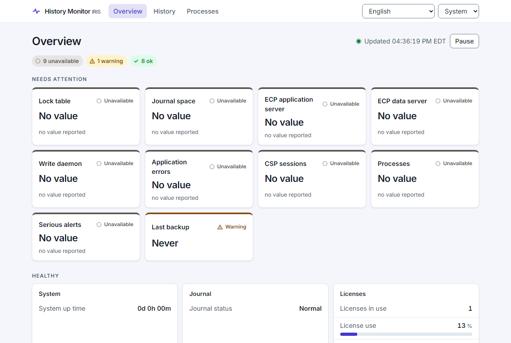
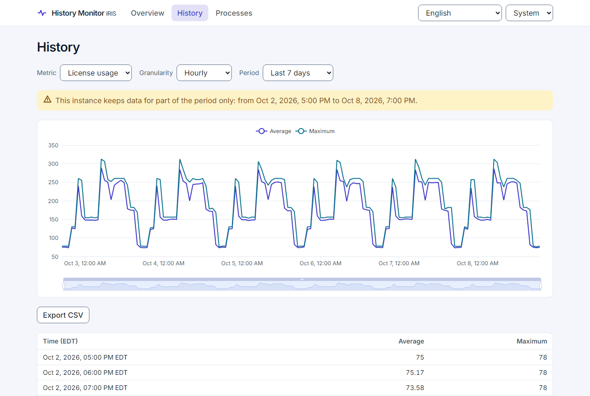
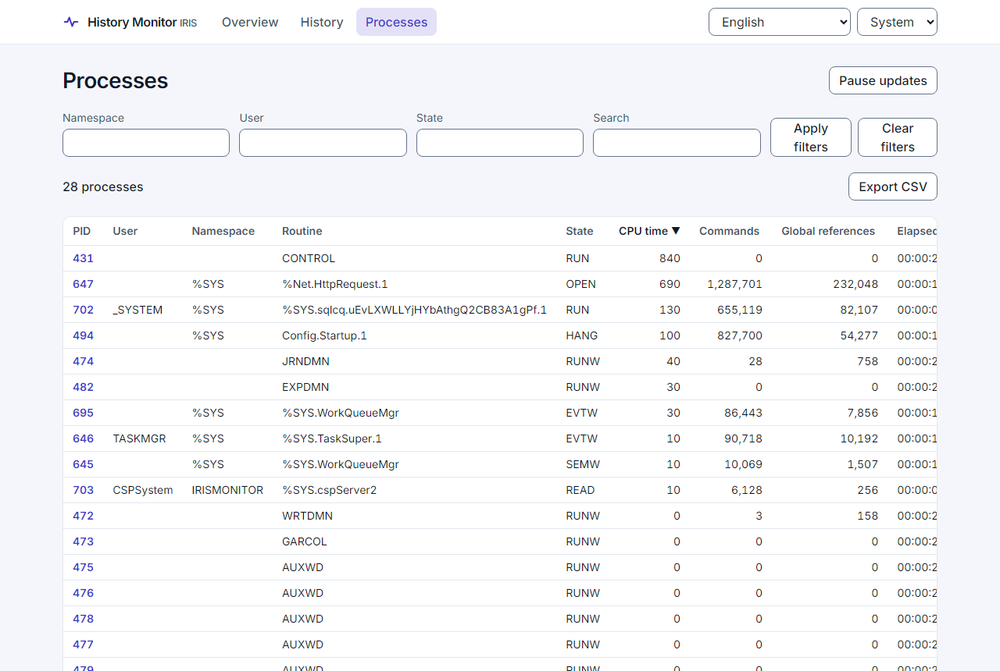
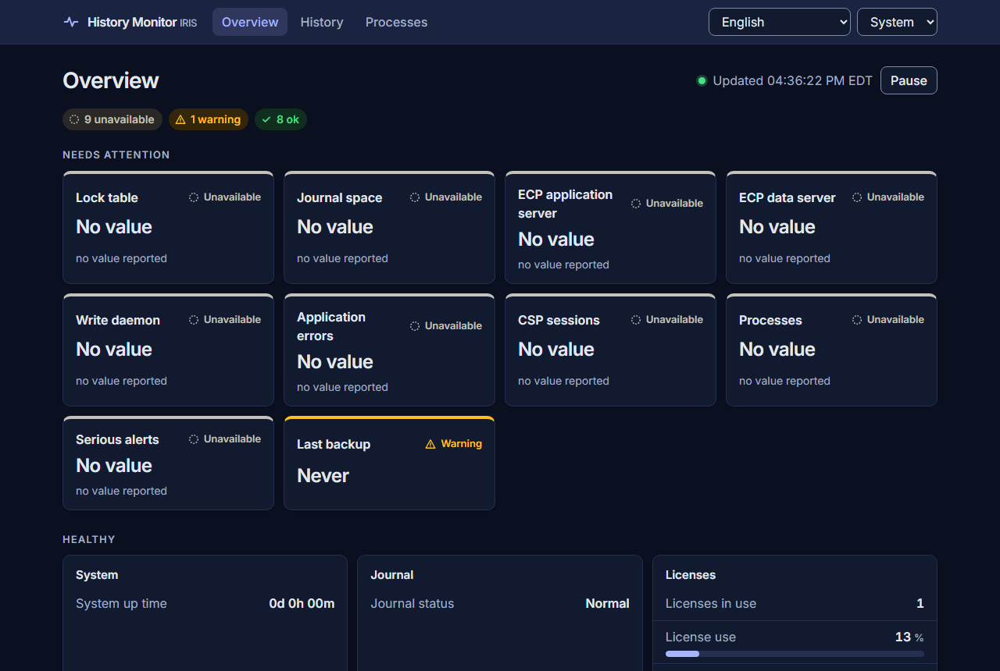

# IRIS History Monitor

A monitor for InterSystems IRIS. It shows, in one place, the state of an instance right now (Overview),
how it changed over time (History, from the System Monitor `^%SYSMONMGR` data in `SYS.History`), and
what its processes are doing (Processes).



## What you get

- **Overview**: every dashboard metric with its state (OK, warning, critical, unavailable). Metrics that
  need attention come first; the page refreshes by itself and can be paused.
- **History**: license use, CSP sessions and database size, every 5 minutes, hourly or daily, as a chart
  with zoom and as a table. Hourly and daily show average and maximum. Export to CSV.
- **Processes**: the process list with filters (namespace, user, state, text), sorting, paging, details
  of one process, and export to CSV.
- English, Portuguese (Brazil) and Spanish; light, dark or system theme; keyboard and screen reader
  friendly (WCAG 2.2 AA).
- A versioned REST API, `/historymonitor/api/v1`, which the interface uses as its only data source.
  Contract: [`specs/001-api-v1/contracts/openapi.yaml`](specs/001-api-v1/contracts/openapi.yaml).

| History | Processes |
| --- | --- |
|  |  |



## Install

Needs IRIS 2026.1 or later (tested on IRIS Community 2026.1) and IPM 0.10.9 or later.

### With IPM, on your instance

```objectscript
zpm "install iris-history-monitor"
```

or, from a clone of this repository:

```objectscript
zpm "load /path/to/iris-history-monitor"
```

Then, as an administrator, switch the new interface on (it is off after a first install):

```objectscript
do ##class(diashenrique.historymonitor.util.Settings).SetInterfaceEnabled(1)
```

### With Docker

```shell
git clone https://github.com/diashenrique/iris-history-monitor.git
cd iris-history-monitor
docker compose up -d --build
```

The image installs the module with IPM and turns the interface on. Ports come from `.env`
(`IRIS_PORT=52773`, `IRIS_SUPERSERVER_PORT=1972`).

## Use

Open <http://localhost:52773/historymonitor/index.html> and sign in. In the Docker image the user is
`_SYSTEM` with password `SYS`; **change it** before the container is reachable by anyone else. The
Management Portal also gets a favourite, *History Monitor*, that opens the same page.

To let someone use the monitor without being an administrator, give them the role
`HistoryMonitorViewer` (created by the install). It allows reading the monitor and nothing else.

A new instance has little history. To see the History page with data, load demo history in `%SYS`:

```objectscript
zn "%SYS"
do ##class(SYS.History.SysData).Demo(30)
```

### The old pages

The previous pages (`/csp/irismonitor/dashboard.csp` and the others) still answer, with a banner that
says they are obsolete and links to the new monitor. They are no longer in the menu and will be removed
in a later release.

## Develop

- ObjectScript lives in `src/cls/diashenrique/historymonitor` (`api`, `service`, `util`, `web`, and the
  old `dashboard`). Tests are in `.../test`; run them in the module's namespace with
  `do ##class(%UnitTest.Manager).RunTest("diashenrique/historymonitor/test","/nodelete")`.
- The interface lives in `web/` (React, TypeScript, Vite). The built files are committed to
  `src/web/historymonitor/`, so IRIS serves them as static files with no build step on the server.

```shell
cd web
npm ci
npm test          # unit and accessibility tests, fixtures checked against the API contract
npm run build     # writes src/web/historymonitor/ (commit the result)
```

End-to-end tests run the interface against a real IRIS. Start a container with this repository mounted
at `/home/irisowner/repo`, prepare it, then run Playwright:

```shell
export HM_VIEWER_PASSWORD=... HM_NOROLE_PASSWORD=...
.github/ci/e2e-setup.sh <container>
cd web && npm run e2e   # HM_BASE_URL, default http://localhost:52773/historymonitor/
```

Changes follow the spec-driven workflow in [`CLAUDE.md`](CLAUDE.md) and
[`.specify/memory/constitution.md`](.specify/memory/constitution.md); specs are in [`specs/`](specs/).
CI runs the ObjectScript tests, an IPM install check, the interface tests, the end-to-end tests and the
Docker image.

## Security notes

- Every API call needs a signed-in user with the `HistoryMonitorViewer` role (or an administrator).
  Errors come back as `application/problem+json`.
- The interface loads no code from other sites. A Content-Security-Policy header, if you want one, is
  set in the web server in front of IRIS, not by this module.

## License

[MIT](LICENSE).
